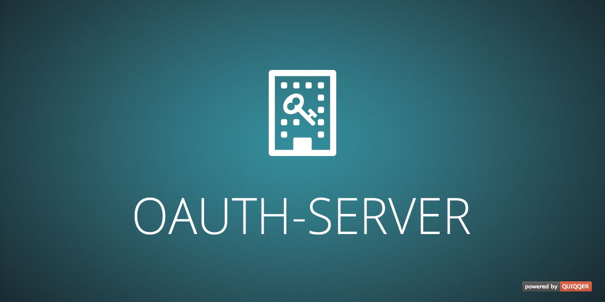

QUIQQER OAuth Server
========

Control all your QUIQQER REST API requests via OAuth authentication and set individual query limits for each OAuth client. 

Package Name:

    quiqqer/oauth-server


Features
--------
* Create and manage OAuth clients with individual access configuration
* All REST API endpoints that are registered by the REST providers in your QUIQQER system are treated
as OAuth scopes
  * Each scope can be individually configured for each OAuth client
  * Limit queries per time interval (i.e. "1000 queries / hour") or allow unlimited access
  * Optionally turn off OAuth authentication for REST API endpoints in the settings
* Supported grant types
  * `authorization_code` with mandatory PKCE S256 and explicit user consent
  * `refresh_token` with refresh token rotation
  * `client_credentials`
* OAuth Authorization Server and Protected Resource metadata
* Resource-bound access and refresh tokens
* Authenticated token revocation
* Implemented as a Slim middleware (https://www.slimframework.com/)

Authorization clients
---------------------
Authorization clients can be registered statically by an administrator through
`QUI\OAuth\Clients\Handler::createAuthorizationClient()`, supplying the exact redirect URIs, allowed resource
identifiers, allowed scopes and whether the client is public.

For MCP clients such as Codex, RFC 7591 Dynamic Client Registration is controlled through
`general.dynamic_client_registration`. When enabled, the Authorization Server metadata advertises
`/api/oauth/register`. The endpoint accepts public Authorization Code clients only:

* mandatory PKCE S256;
* `token_endpoint_auth_method` must be `none`;
* only `authorization_code` and `refresh_token` grants;
* exact, validated redirect URIs;
* the first authorization request permanently binds the client to one resource on the QUIQQER origin or on an
  explicitly configured QUIQQER VHost domain.

Dynamic registration is enabled by default. Deployments should additionally apply normal edge rate limiting to
`/api/oauth/register`.

Cross-origin protected resources are trusted only when their HTTPS origin matches an explicitly configured
QUIQQER VHost domain. Wildcard VHosts are not expanded for OAuth trust. The policy is re-evaluated during
subsequent authorization and token requests, so removing a VHost prevents new tokens and refreshes for dynamically
registered clients bound to it. Existing access tokens remain valid until they expire or are revoked.

Refresh tokens issued to dynamically registered clients are reusable by default. This allows independent,
long-running MCP client processes such as multiple Codex instances to share one credential without invalidating its
token family. Refresh responses issue a new access token and omit a replacement refresh token. Explicit revocation
and expiry remain effective. Set `general.reuse_refresh_tokens_for_dynamic_clients` to `0` to enforce strict
refresh token rotation for these clients as well. Static authorization clients always use strict rotation.

The Authorization Server issuer and default protected resource identifier are the absolute QUIQQER REST base URL.
Discovery is exposed at the origin root, independently of the configured REST base path:

* `/.well-known/oauth-authorization-server`
* `/.well-known/oauth-protected-resource`

The metadata returned there points to the OAuth endpoints below the REST base path, for example
`/api/oauth/authorize`, `/api/oauth/token` and `/api/oauth/revoke`.

If an OAuth authorization request is opened without an authenticated QUIQQER session, the authorization endpoint
renders the configured QUIQQER login control and continues with the consent screen after a successful login.
Consent presentation extensions
-------------------------------
Installed modules can add resource-specific, informational sections to the consent screen through the
`onQuiqqerOAuthConsentPresentation` event. The event receives a read-only
`QUI\OAuth\Consent\Context` and a mutable `QUI\OAuth\Consent\Presentation`:

```php
public static function onQuiqqerOAuthConsentPresentation(
    \QUI\OAuth\Consent\Context $Context,
    \QUI\OAuth\Consent\Presentation $Presentation
): void {
    if ($Context->getResource() !== 'https://example.test/my-resource') {
        return;
    }

    $Presentation->addSection('Available functions', [
        ['type' => 'Resource', 'name' => 'project_information'],
        ['type' => 'Tool', 'name' => 'project_update']
    ]);
}
```

Listeners may customize the title and description, add informational sections or replace the default scope section
with a resource-specific representation by calling `clearSections()`. The context exposes the authenticated user,
client, resource and requested scopes. Protocol-critical authorization parameters and the scopes actually granted
cannot be changed through this API. Listener failures are logged and do not interrupt the OAuth flow.

Installation
------------
The Package Name is: quiqqer/oauth-server

Contribute
----------
- Project: https://dev.quiqqer.com/quiqqer/oauth-server
- Issue Tracker: https://dev.quiqqer.com/quiqqer/oauth-server/issues
- Source Code: https://dev.quiqqer.com/quiqqer/oauth-server/tree/master

Support
-------
If you found any errors or have wishes or suggestions for improvement,
please contact us by email at support@pcsg.de.

We will transfer your message to the responsible developers.

License
-------
LGPL-3.0-or-later
